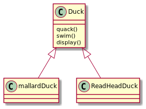
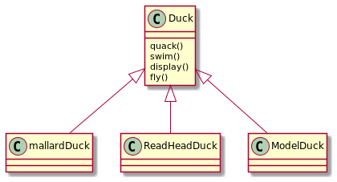

# 策略模式

## 问题

现在要利用标准的OO技术，设计一个鸭子的superclass, 并让各种鸭子继承这个超类。

比如：



如果要加入飞行的 方法呢？ 看似可以在超类中加入fly()，但是子类中如果有了玩具鸭子，它并不会飞，那么问题就出现了。



解决方法是什么呢？


## 解决问题

1. 我们首先认为所有鸭子都有swim的能力，但并不是所有的鸭子都有fly和quack的能力，而且他们swim和quack的能力实现也是不一样的，
2. 所有的鸭子都有swim的能力，那么swim是不变的，而fly和quack是变化的。我们把fly和quack取出来，不要和那些不需要变化的代码混在一起。

## 定义

策略模式定义了算法族， 分别封装起来，让他们之间可以互相替换，此模式让算法的变化独立于使用算法的客户。

## 设计原则

1. 找出应用中可能需要变化之处，把它们独立出来，不要和那些不需要变化的代码混在一起。

   把会变化的部分取出封装起来，以便以后可以轻易改动或者扩展此部分，而不影响不需要变化的其它部分。

2. 针对接口编程，而不是针对实现编程

   ```java
   // 针对实现编程
   Dog d = new Dog();
   d.bark();
   
   // 针对接口编程
   Animal animal = new Dog();
   animal.makeSound();
   ```

3. 多用组合，少用继承